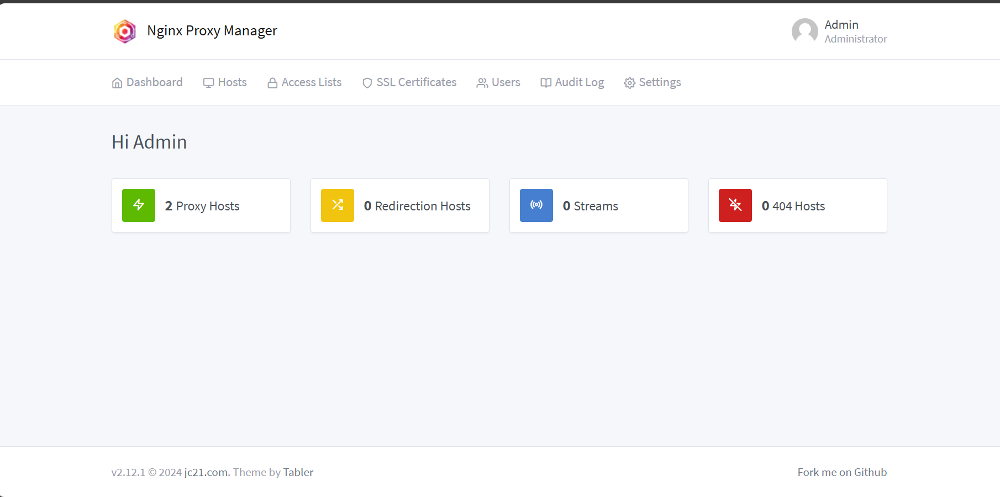
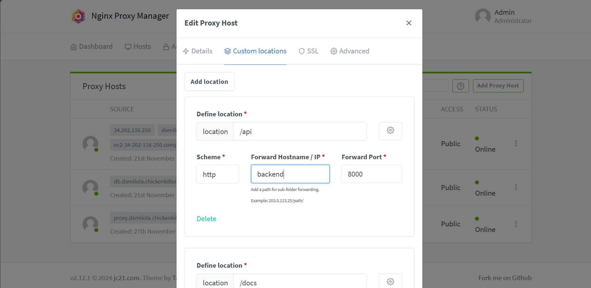
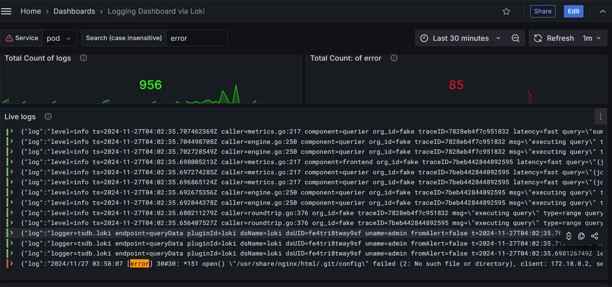

+++
title = 'Compose Your App: Deploying and Monitoring a Full-Stack App with Modern DevOps Tools.'
date = 2024-11-27T01:50:50+01:00
draft = false
tags = ['containers', 'docker', 'devops', 'devops-projects-challenge']
+++

This year I decided to venture into the realm of practical DevOps adventures and I was lucky to stumble upon a set of DevOps challenges spanning 6 weeks, where each week we battle with some unique problem-solving scenarios involving various DevOps tools and technologies. This article is a documentation of my first challenge which is _Deploying a containerized application and monitoring stack to the cloud, and configuring a reverse proxy._

The goal was to deploy a full-stack application with a React frontend, FastAPI backend and a PostgreSQL database in separate containers with docker-compose, putting all HTTP services behind a reverse proxy and managing configuration for the reverse proxy, collecting logs and container metrics and building a dashboard to visualize them.

To achieve this, I had to learn about:

- Deploying multi-container applications with [**docker-compose**](https://docs.docker.com/compose/)
- Setting up [adminer](https://www.adminer.org/) for database management.
- Configuring a reverse proxy with [**Nginx Proxy Manager**](https://nginxproxymanager.com)
- Collecting metrics with [**prometheus**](https://prometheus.io) and [**cAdvisor**](https://github.com/google/cadvisor)
- Aggregating logs with [**Loki**](https://grafana.com/docs/loki/latest/) and [**Promtail**](https://grafana.com/docs/loki/latest/send-data/promtail/)
- Adding dashboards to [Grafana](https://grafana.com/grafana/).
- Deploying to a VM on the cloud with a custom domain.

Now let's proceed.

## Docker Containers

It might not be obvious, but to "dockerize" our application, we need to have [docker](https://docs.docker.com/get-started/get-docker/) running and use docker-compose to deploy multiple containers, one for each service. The services to be deployed include:

- Frontend service
- Backend service
- Postgres service
- Adminer service
- Nginx reverse proxy service
- Grafana service
- Prometheus service
- Loki service
- Promtail service
- cAdvisor service

All these services will be deployed on a single VM in the cloud, the services can be categorized into two stacks each with a docker-compose configuration file:

- An application stack: Frontend, Backend, Postgres, Adminer, Nginx proxy manager
- A monitoring stack: Grafana, Prometheus, Loki, Promtail and cAdvisor

We begin with the application stack, we first have to build docker images for our backend and frontend services and we do that by creating two `Dockerfile`s in our project's root directory. The link to the project repo can be found [here](https://github.com/The-DevOps-Dojo/cv-challenge01).

```bash
git clone https://github.com/The-DevOps-Dojo/cv-challenge01.git

cd cv-challenge01

touch Dockerfile.backend Dockerfile.frontend
```

```Dockerfile
# Dockerfile.backend
FROM python:3.10-slim
WORKDIR /opt/dojo
RUN apt-get update && apt-get install -y curl
RUN curl -sSL https://install.python-poetry.org | POETRY_HOME="/opt/poetry" POETRY_VERSION=1.8.3 python3 -
ENV PATH="/opt/poetry/bin:${PATH}"
COPY backend/pyproject.toml backend/poetry.lock .
RUN poetry install
ENV PYTHONPATH="/opt/dojo"
COPY backend/ .
RUN curl -o wait-for-it.sh https://raw.githubusercontent.com/vishnubob/wait-for-it/master/wait-for-it.sh
RUN chmod +x wait-for-it.sh
EXPOSE 8000
CMD ["sh", "-c", "./wait-for-it.sh -s postgres:5432 -- poetry run bash ./prestart.sh && poetry run uvicorn --host 0.0.0.0 --port 8000 app.main:app --reload"]
```

```Dockerfile
# Dockerfile.frontend

FROM node:18 AS build
WORKDIR /opt/app
COPY frontend/package.json frontend/package-lock.json ./
RUN npm install
COPY frontend/ .
ENV VITE_API_URL="http://<localhost or VM server hostname/ip>"
RUN npm run build

FROM nginx:stable-alpine AS production
COPY --from=build /opt/app/dist /usr/share/nginx/html
EXPOSE 80
CMD ["nginx", "-g", "daemon off;"]
```

Now that we have our Dockerfiles ready, we need to create our docker-compose configuration file for the application stack.

```bash
touch docker-compose.app.yml
```

and the content includes the following:

```yaml
services:
  frontend:
    build:
      context: .
      dockerfile: Dockerfile.frontend
    networks:
      - app_network

  postgres:
    image: postgres:16
    environment:
      - POSTGRES_DB=challenge01
      - POSTGRES_PASSWORD=Pssw0rd
    volumes:
      - postgres:/var/lib/postgresql/data
    ports:
      - "5432:5432"
    networks:
      - app_network

  backend:
    build:
      context: .
      dockerfile: Dockerfile.backend
    networks:
      - app_network
    depends_on:
      - postgres

  adminer:
    image: adminer
    restart: always
    networks:
      - app_network

  proxy-manager:
    image: "jc21/nginx-proxy-manager:latest"
    restart: unless-stopped
    ports:
      - "80:80"
      - "443:443"
      - "81:81"
    volumes:
      - ./data:/data
      - ./letsencrypt:/etc/letsencrypt
    networks:
      - app_network

networks:
  app_network:
    driver: bridge

volumes:
  postgres:
    driver: local
```

Modify the `backend/.env` file to include our database credentials, we are hardcoding these in the docker-compose file for convenience, in a production environment, this is bad practice as secrets as this should not be exposed publicly.

```bash
POSTGRES_SERVER="postgres"
POSTGRES_PORT=5432
POSTGRES_DB=challenge01
POSTGRES_USER=postgres
POSTGRES_PASSWORD="Pssw0rd"
```

With the enviroment variables set, we can run our docker-compose command to build and run our code. But remember we created a `docker-compose.app.yml` file and we will be creating another config file for the monitoring stack but the docker-compose tool uses a `docker-compose.yml` file as default which can be overriden by passing the `-f` flag to the command. So we have the option to pass this file explicitly with the `-f` flag or we can set an appropriate variable to tell docker-compose where to find the config files. We would be taking the latter approach.

Create a `.env` file in the project's root directory and set the contents to the following:

```bash
COMPOSE_FILE=docker-compose.app.yml
```

This tells docker-compose where to find the configuration files. With this setup, we can run our docker-compose command

```bash
docker-compose up -d --build
```

This would build and start the services we have defined so far, all our services should be up, but how do we access them?

## Reverse Proxy Setup

A **reverse proxy** is a server that sits between client devices and backend servers, forwarding client requests to the appropriate server and then returning the server's response back to the client. It acts as an intermediary, managing traffic and providing various benefits like security, scalability, and load balancing. In this challenge, we will be using Nginx and nginx proxy manager to manage traffic to our containers.

If you inspect our `docker-compose.app.yml` file, you would notice only our proxy-manager service has the host-container ports mapped, `80` for HTTP, `443` for HTTPS and `81` is an admin interface for nginx proxy manager, this is the only http service we are exposing to the internet, traffic would be routed internally through our reverse proxy.

Navigate to `http://localhost:81` (or your server's IP/DNS hostname on port 81) and you should see the admin login interface.


After logging in for the first time you are asked to input a new password and email, then you should be able to set proxy rules to route traffic from our proxy-manager container to other containers since they are in the same network according to our config file.



Click on "Proxy Hosts" to begin configuring proxy setting for your services.


To add a proxy host configuration, click on the "Add Proxy Host" button and it should bring up


Put your server domain name in the "Domain Names" input, and put the value `proxy-manager` as defined in our compose config as the Forward destination on port 80, so every request is forwarded to port 80, then navigate to the "Custom Locations" tab to set routing rules.



For each entry in the table below, click on "Add Location" to define the following routing rules.

| Location    | Forward Hostname/IP         | Port |
| ----------- | --------------------------- | ---- |
| /           | frontend                    | 80   |
| /api        | backend                     | 8000 |
| /docs       | backend/api/v1/openapi.json | 8000 |
| /prometheus | prometheus                  | 9090 |
| /grafana    | grafana                     | 3000 |
| /loki       | loki                        | 3100 |
| /promtail   | promtail                    | 9080 |
| /cadvisor   | cadvisor                    | 8080 |

We would come back to the rest of the services, let us focus on the application stack, if everything goes well, you should be able to visit your server's IP/hostname and see the frontend application, log in with the credentials in the `backend/.env` file and voila! you are a seasoned DevOps engineer.

Some routes may need further configuration especially with handling redirection, so you may need to add some custom Nginx configuration by clicking on the setting icon for the specific location and adding the following

```nginx
location /<location> {
  rewrite ^/<location>/(.*)$ /$1 break;
  proxy_pass <container-name>:<container-port>/;
  proxy_redirect / /<location>/;
}
```

Replace location with the appropriate location you are defining and the corresponding container-name and container-port.
e.g

```nginx
location /prometheus {
  rewrite ^/prometheus/(.*)$ /$1 break;
  proxy_pass http://cv-challenge01-prometheus-1:9090/;
  proxy_redirect / /prometheus/;
}
```

This helps fix some common redirection issues, particularly for services like prometheus, and grafana.

Finally create another proxy host, this time for the `adminer` service, similar to how we routed all requests from our domain through our proxy-manager container, we would route a subdomain `db.<domain>` to the adminer container.

## Monitoring and Logging

To setup our monitoring stack, we create a `docker-compose.monitoring.yml` file to define our services

```bash
touch docker-compose.monitoring.yml
```

```yaml
services:
  prometheus:
    image: prom/prometheus:latest
    restart: always
    volumes:
      - ./prometheus.yml:/etc/prometheus/prometheus.yml:ro
    command:
      - "--config.file=/etc/prometheus/prometheus.yml"
    networks:
      - app_network

  grafana:
    image: grafana/grafana:latest
    restart: always
    environment:
      - "GF_INSTALL_PLUGINS=https://storage.googleapis.com/integration-artifacts/grafana-lokiexplore-app/grafana-lokiexplore-app-latest.zip;grafana-lokiexplore-app"
    volumes:
      - grafana-storage:/var/lib/grafana
      - ./grafana.ini:/etc/grafana/grafana.ini:ro
    networks:
      - app_network

  loki:
    image: grafana/loki:latest
    command: -config.file=/etc/loki/config.yml
    volumes:
      - ./loki-config.yml:/etc/loki/config.yml
    networks:
      - app_network

  promtail:
    image: grafana/promtail:latest
    volumes:
      - /var/log:/var/log
      - /var/lib/docker/containers:/var/lib/docker/containers:ro # FOR WSL2 docker volume see more (https://github.com/vacp2p/wakurtosis/issues/58)
      - ./promtail-config.yml:/etc/promtail/config.yml
    command: "-config.file=/etc/promtail/config.yml"
    networks:
      - app_network

  cadvisor:
    image: gcr.io/cadvisor/cadvisor:latest
    volumes:
      - /:/rootfs:ro
      - /var/run:/var/run:rw
      - /sys:/sys:ro
      - /var/lib/docker/:/var/lib/docker:ro
      - /dev/disk:/dev/disk:ro
    networks:
      - app_network

volumes:
  grafana-storage:
    driver: local
```

We also need to setup configuration files for prometheus, grafana, loki and promtail. So create the following files

```bash
touch prometheus.yml grafana.ini loki-config.yml promtail-config.yml
```

```yml
# prometheus.yml
global:
  scrape_interval: 15s
  evaluation_interval: 15s

scrape_configs:
  - job_name: "prometheus"
    static_configs:
      - targets:
          - "localhost:9090"

  - job_name: "loki"
    static_configs:
      - targets:
          - "loki:3100"

  - job_name: "promtail"
    static_configs:
      - targets:
          - "promtail:9080"

  - job_name: cadvisor
    scrape_interval: 5s
    static_configs:
      - targets:
          - "cadvisor:8080"
```

```ini
# grafana.ini
[server]
# URL to serve Grafana from, it is important that this matches the URL used by the client.
root_url = %(protocol)s://%(domain)s:%(http_port)s/grafana/
```

```yml
# loki-config.yml
auth_enabled: false

server:
  http_listen_port: 3100
  grpc_listen_port: 9096

common:
  instance_addr: 127.0.0.1
  path_prefix: /tmp/loki
  storage:
    filesystem:
      chunks_directory: /tmp/loki/chunks
      rules_directory: /tmp/loki/rules
  replication_factor: 1
  ring:
    kvstore:
      store: inmemory

query_range:
  results_cache:
    cache:
      embedded_cache:
        enabled: true
        max_size_mb: 100

schema_config:
  configs:
    - from: 2020-10-24
      store: tsdb
      object_store: filesystem
      schema: v13
      index:
        prefix: index_
        period: 24h

ruler:
  alertmanager_url: http://localhost:9093
# By default, Loki will send anonymous, but uniquely-identifiable usage and configuration
# analytics to Grafana Labs. These statistics are sent to https://stats.grafana.org/
#
# Statistics help us better understand how Loki is used, and they show us performance
# levels for most users. This helps us prioritize features and documentation.
# For more information on what's sent, look at
# https://github.com/grafana/loki/blob/main/pkg/analytics/stats.go
# Refer to the buildReport method to see what goes into a report.
#
# If you would like to disable reporting, uncomment the following lines:
#analytics:
#  reporting_enabled: false
pattern_ingester:
  enabled: true
limits_config:
  allow_structured_metadata: true
  volume_enabled: true
```

```yml
# promtail-config.yml
server:
  http_listen_port: 9080
  grpc_listen_port: 0

positions:
  filename: /tmp/positions.yaml

clients:
  - url: http://loki:3100/loki/api/v1/push

scrape_configs:
  - job_name: system
    static_configs:
      - targets:
          - localhost
        labels:
          job: varlogs
          __path__: /var/log/*log

  - job_name: containers
    static_configs:
      - targets:
          - localhost
        labels:
          job: "containerlogs"
          __path__: /var/lib/docker/containers/*/*.log
```

Edit the .env file in the root folder like so:

```bash
COMPOSE_FILE=docker-compose.app.yml:docker-compose.monitoring.yml
```

Now we are telling docker-compose to use these two config files to run our containers. We can now run our containers with the command

```bash
docker-compose up -d
```

These should start all our services. If all goes well, you should be able to access the routes defined earlier in the reverse proxy. If any issues confirm the services are up or play around with the proxy manager custom location settings

Navigate to the `/grafana` route and login with the credentials `admin` for both username and password, you will be prompted to change this after logging in.

Open the menu and navigate to "Connections" and select "Data Sources", add loki and prometheus as data sources,
once configured with the appropriate URLs, we can proceed to create a dashboard.

To save time, we can import community made [dashboards](https://grafana.com/grafana/dashboards/) like this [one](https://grafana.com/grafana/dashboards/21361-docker-cadvisor-compute-resources/) or you can create your own dashboards


The dashboard above uses metrics from prometheus exported by cAdvisor to give insights on container resource usage. Similarly you can set up dashboards with your Loki source to stream and visualize log data.



That's about it for our monitoring stack, right now we have been able to setup our application and monitoring stacks, but we need to deploy this to a VM so it is publicly available.

## Cloud Deployment

To make our application available to the public, we need a domain name, you can get a free subdomain with [Afraid DNS](https://freedns.afraid.org/subdomain/), we also need our target VM with a public IP address, we can setup an [EC2 server on AWS](https://docs.aws.amazon.com/AWSEC2/latest/UserGuide/EC2_GetStarted.html) with docker installed, you can put the script to install docker and add your user to a group in the User Data section before launching the instance, so it runs while the server is being provisioned. Also ensure the following ports are open in the security groups or firewall. Ports 22, 80, 81, 443

Once that is out of the way and we have our IP address, we should point our domain name to this IP address, then we can go ahead to copy our development files over to our VM using `scp`. In our project's root folder, copy everything to our VM like so

```bash
scp -ri "key.pem" . user@hostname:/home/ubuntu
```

Ensure our docker-compose files were copied over and .env file, then run the docker-compose up command

```bash
docker-compose up -d --build
```

Make sure to set the reverse proxy configuration if you did it on localhost initially, then add SSL to your domain by either getting a free certificate from Let's Encrypt right there in the Nginx Proxy Manager admin interface or add a custom one. Once SSL is set up and routing is working fine, we are done!. 🎊🎊🎊

To avoid CORS errors when accessing the frontend, update the `backend/.env` to include your domain name in the `BACKEND_CORS_ORIGINS` variable.

## Wrapping Up

We have been able to deploy a fullstack application and monitoring tools for our deployment with the help of docker-compose. docker-compose is a simple tool and I am aware that when running production grade apps, there are other preferred industry-standard alternatives like kubernetes, but we have been able to get a taste of what is required to take an app from code to deployment. You can find my repo with full solution [here](https://github.com/0xdod/cv-challenge01)

We have learned to use tools like grafana, loki, promtail, prometheus and cadvisor to make our systems observable which is standard industry practice, also learned about reverse proxys and how to manage proxy configurations with a simple tool like nginx proxy manager.

By combining these tools, we’ve built a solid infrastructure that ensures real-time monitoring of our application's health and performance. This framework enables us to promptly detect and address issues, establishing a reliable base for maintaining and scaling the workloads effectively.
