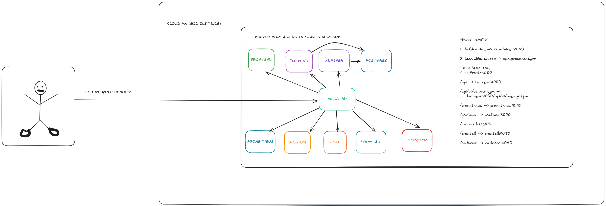

+++
title = 'Deploy Destroy Repeat: Automating Deployments with Terraform and Ansible'
date = 2024-12-03T15:38:25+01:00
draft = false
tags = ['terraform', 'ansible', 'IaC', 'devops', 'devops-projects-challenge']
+++

It is week 2 of my devops project challenges and the challenge of the week was to automate the deployment and configuration of the [previous](/posts/compose-your-apps) week's challenge. It feels like the next step in the DevOps process, you have been able to package your applications, but you still need to setup infrastructure and many times repeatedly, doing this manually is not only tedious and time consuming but can lead to inconsistencies in the running environments for your applications, more importantly, it doesn't scale.

In this week's challenge we would be using the popular [IaC](https://aws.amazon.com/what-is/iac/) tool [Terraform](https://www.terraform.io/) in conjunction with the popular automation and configuration management tool [Ansible](https://www.ansible.com/) to create a automated deployment process for our applictions. The goal is to be able to provision, configure and run all the necessary infrastructure required and then also pull them down when necessary, all with one command.

```bash
terraform apply -auto-approve
```

To achieve this, we are going to need to be familiar with a couple of tools which should be installed on our machine.

- Terraform: To automate infrastructure provisioning
- Ansible: To automate the configuration of our infrastructure and manage our application
- AWS CLI: Used for AWS get specific information on the state of our infrastructure
- Bash scripting: To write custom logic during automation

## Application Overview

To provide a recap of [week one](/posts/compose-your-apps) challenge, we packaged our apps into docker containers, consisting of a frontend appliaction, backend application, a database and host of monitoring services, then put all these services behind a reverse proxy to route traffic to the appropriate target, so all our HTTP services are only exposed through the reverse proxy. This diagram shows the architecture of our app



The repo for this week's challenge can be found [here](https://github.com/The-DevOps-Dojo/cv-challenge-o2).

## Terraform

[Terraform](https://www.terraform.io/) is an open-source Infrastructure as Code (IaC) tool that allows you to define, provision, and manage infrastructure resources across various cloud providers and on-premises environments using a high-level configuration language called HCL.
We would be using Terraform to create our EC2 instance and to trigger Ansible to begin configuring our provisioned instance.

But before that, we would need to build, tag and push the docker images for our frontend and backend application to a container registry so we can pull these easily. Fork the [repo](https://github.com/The-DevOps-Dojo/cv-challenge-o2) and clone to your local machine, copy over the files from the previous week's challenge to our new repo run the following commands to build and push.

```bash
docker login # do this if you have not logged in

docker build -f Dockerfile.frontend .
docker build -f Dockerfile.backend .

docker images # note the image id for your frontend and backend images

docker tag <IMAGE_ID> <DOCKERHUB_USERNAME>/frontend:latest # replace <IMAGE_ID> and <DOCKERHUB_USERNAME>
docker tag <IMAGE_ID> <DOCKERHUB_USERNAME>/backend:latest # replace <IMAGE_ID> and <DOCKERHUB_USERNAME>


docker push <DOCKERHUB_USERNAME>/frontend:latest
docker push <DOCKERHUB_USERNAME>/backend:latest
```

Now that we have pushed our image to dockerhub, we have to modify our `docker-compose.app.yml` to pull these images instead.

```yaml
services:
    frontend:
    image: <DOCKERHUB_USERNAME>/frontend:latest
    networks:
      - app_network

    backend:
    image: <DOCKERHUB_USERNAME>/backend:latest
    networks:
      - app_network
    # ...
```

This way, we only rely on the already built docker images, somewhat seperating our build and deploy stages. With these out of the way, we can start terraforming the chaos of infrastructure deployment.

We would proceed by writing HCL config files to define our infrastructure. Create a main.tf file and variables.tf file. Our main.tf file houses our infrastructue definitions and variables.tf contains our variables. We want to provision an EC2 instance with docker and docker-compose installed.

```hcl
resource "aws_instance" "web_server" {
  ami                         = var.ami
  instance_type               = "t2.micro"
  key_name                    = var.key_name
  vpc_security_group_ids      = var.security_group_ids
  associate_public_ip_address = var.eip == null
  user_data                   = <<-EOF
    #!/bin/bash
    curl -fsSL https://get.docker.com -o get-docker.sh
    sudo sh get-docker.sh
    sudo usermod -aG docker ubuntu
    newgrp docker
    curl -SL https://github.com/docker/compose/releases/download/v2.30.3/docker-compose-linux-x86_64 -o docker-compose
    sudo chmod +x docker-compose
    sudo mv docker-compose /usr/local/bin/docker-compose
  EOF

  tags = {
    Name = "web_server"
  }

}

resource "aws_eip_association" "eip_assoc" {
  count               = var.eip == null ? 0 : 1
  instance_id         = aws_instance.web_server.id
  allow_reassociation = true
  allocation_id       = var.eip
}
```

in variables.tf

```hcl
variable "security_group_ids" {
  description = "The AWS security group to apply."
  type        = list(string)
}

variable "ami" {
  description = "The AMI ID to use for the instance."
  type        = string
  default     = "ami-0866a3c8686eaeeba"
}

variable "key_name" {
  description = "Key pair"
  type        = string
}

variable "eip" {
  description = "Optional Elastic IP address to associate with instance if present"
  type        = string
  default     = null
}

variable "domain_name" {
  description = "The domain name to use for the application."
  type        = string
}
```

We would use environment variables to set the values for these variables and to do that, values for these variables can be gotten from your AWS console e.g the AMI ID, key pair etc. Terraform requires the `TF_VAR_` prefix for each defined variable, we also need to set our AWS IAM credentials to use the AWS plugin for terraform. You could put all these variables in a `.env` file and source it in your current terminal session to make these variables reflect.

```
export AWS_ACCESS_KEY_ID="anaccesskey"
export AWS_SECRET_ACCESS_KEY="asecretkey"
export AWS_REGION="us-west-2"
export TF_VAR_ami="ami-eba"
export TF_VAR_security_group_ids='["sg-eba"]'
export TF_VAR_domain_name="mydomain.com"
export TF_VAR_eip="eipalloc-xxxxx" # optional to use elastic ip
```

The next step is to tell terraform to initialize our project by running the command:

```bash
terraform init
```

This command fetches all our plugins listed in the main.tf file. We can then run the plan command to understand how terraform is going to provision these resources

```bash
terraform plan
```

We will see a plan on what terraform will create and how it plans to do so. Now we can run our apply command to provision the resources.

```bash
terraform apply
```

It would display a prompt asking if you want to proceed, type yes and watch magic happen. In few minutes, you should have your EC2 instance running, and you can SSH into it to confirm it is accessible. We shall the proceed to configuring our server to run our apps with ansible.

## Ansible

We would use ansible to pull our docker images to our host platform which already has docker installed, copy over the necessary config files for our monitoring services and reverse proxy, generate free SSL certificates to enable HTTPS and start our containers.

First, we need to generate an inventory file to tell ansible about our remote hosts, i.e the EC2 instance, we need the IP address of this instance and we can get that by modifying our terraform config file to include this step after provisioning the instance.

In the main.tf file, add the following:

```hcl
resource "local_file" "ansible_inventory" {
  content  = <<-EOF
    [web_servers]
    ${var.eip != null ? aws_eip_association.eip_assoc.public_ip : aws_instance.web_server.public_ip} ansible_user=ubuntu ansible_ssh_private_key_file=devops_challenge.pem
  EOF
  filename = "${path.module}/inventory.ini"
  file_permission = 0644
}

```

This would create local file on our host machine named `inventory.ini` which would contain the IP address of our newly created EC2 instance.

```ini
[web_servers]
34.116.202.250 ansible_user=ubuntu ansible_ssh_private_key_file=key_pair.pem
```

Make sure you have the key pair used to launch the EC2 instance saved as this would be needed when ansible wants to connect to your servers.

Run the `terraform init` command again to fetch the `local` provider for the `local_file` resource and run the `terraform plan && terraform apply` commands to see your new inventory file. This tells ansible what hosts are available to be configured.

Ansible uses playbooks which are just `yaml` files to define plays which contains tasks to be run on each hosts, we would define a playbook to configure our instances but first we need to ensure our instances are up and available before ansible can begin, this is where the `aws` CLI tool will be used to query for our instance state and wait till it is ready. Modify the `local_file` resource like so:

```hcl
resource "local_file" "ansible_inventory" {
  content  = <<-EOF
    [web_servers]
    ${var.eip != null ? aws_eip_association.eip_assoc.public_ip : aws_instance.web_server.public_ip} ansible_user=ubuntu ansible_ssh_private_key_file=devops_challenge.pem
  EOF
  filename = "${path.module}/inventory.ini"
  file_permission = 0644

  provisioner "local-exec" {
    command = <<-EOF
      aws ec2 wait instance-status-ok --instance-ids ${aws_instance.web_server.id}
      ansible-playbook -i inventory.ini -e "APP_SERVER_NAME=${var.domain_name}" ansible/deploy.yml
    EOF
  }
}
```

Create a new folder to house all our ansible related files and create a playbook called `deploy.yml`. We would be using ansible [roles](https://docs.ansible.com/ansible/latest/playbook_guide/playbooks_reuse_roles.html) to organize our ansible configuration and it requires a certain folder structure.

Create the following files

```bash
mkdir -p ansible/roles/web_servers/tasks
mkdir ansible/roles/web_servers/files
touch ansible/deploy.yml
touch ansible/roles/web_servers/tasks/main.yml
```

We just created a `deploy` playbook and `web_server` roles, roles can contain a `tasks/` folder which defines the tasks the role would perform tasks in the `tasks/main.yml` play. The `files/` folder contains files needed for our roles to run, files like the docker-compose files, config files for prometheus, grafana etc and nginx configuration would need to be copied over to the remote host. We can mv those files over to the `files/` directory.

We begin with the `deploy` playbook which contains only one play:

```yaml
- hosts: web_servers
  become: yes
  roles:
    - web_servers
```

The play targets the `web_servers` hosts that was defined in our inventory file and uses the `web_servers` role to run tasks on this target. The `roles/web_servers/tasks/main.yml` would then contain all our tasks for this play.

```yaml
- name: Ensure parent directory exist
  file:
    path: "/home/ubuntu/app"
    state: directory
    mode: "0755"

- name: Copy files
  copy:
    src: "{{ item.src }}"
    dest: "/home/ubuntu/app/{{ item.dest }}"
  loop:
    - src: "docker-compose.app.yml"
      dest: "docker-compose.app.yml"
    - src: "docker-compose.monitoring.yml"
      dest: "docker-compose.monitoring.yml"
    - src: "prometheus.yml"
      dest: "prometheus.yml"
    - src: "loki-config.yml"
      dest: "loki-config.yml"
    - src: "promtail-config.yml"
      dest: "promtail-config.yml"
    - src: "grafana.ini"
      dest: "grafana.ini"
    - src: "nginx"
      dest: "."

- name: Create .env for docker-compose to load
  copy:
    dest: "/home/ubuntu/app/.env"
    content: |
      export COMPOSE_FILE=docker-compose.app.yml:docker-compose.monitoring.yml
      export APP_SERVER_NAME="{{ APP_SERVER_NAME }}"
    mode: 0644

- name: Request LetsEncrypt SSL Cert
  script:
    cmd: "init-certbot.sh"
  become: yes
  args:
    chdir: "/home/ubuntu/app"

- name: Start Docker Containers
  command: docker-compose up -d
  become: yes
  args:
    chdir: "/home/ubuntu/app"
```

The tasks are pretty straight forward, since we already have docker installed on this host in our provisioning phase, we don't need to install it with ansible. We create a folder to contain our files, copy over our files to this directory, pass the necessary environment variables, create SSL certificate for HTTPS and start our services. Easy peasy 😉.

I have written a [script](https://github.com/0xdod/cv-challenge02/blob/main/ansible/roles/web_servers/files/init-certbot.sh) for the SSL certificate creation and also [nginx configuration](https://github.com/0xdod/cv-challenge02/tree/main/ansible/roles/web_servers/files/nginx). At this point, we are close to done. But before we proceed we need to instruct ansible of our roles and where to find them. In the root folder, create an `ansible.cfg` file with the following content

```cfg
[defaults]
host_key_checking = False
roles_path = ./ansible/roles
```

This tells ansible about our roles and also for the sake of development, prevent strict host key checking which is a common issue when dealing with euphemeral hosts like cloud VMs.

We can proceed to run the command to provision and configure our resources

```bash
terraform apply -auto-approve
```

If this runs successfully, you should be able to access your app via the value of the `TF_VAR_domain_name` variable, this setup ensures that with one command we create an EC2 instance, install docker, copy over necessary configuration files, configure nginx as a reverse proxy, request SSL certificates for HTTPS and start our containers.

You can destroy the resources with also one command which terminates the EC2 instance and stops all services from running.

```bash
terraform destroy -auto-approve
```

## Conclusion

We have been able to see how terraform and ansible can work together to automate deployment processes, they can help speed up and streamline the process of deployments in the areas where they shine. Terraform is usually used to provision infrastructure and ansible to configure them. This gives us the ability to deploy infrastructure in an immutable fashion, multiple times a day in a reproducable and deterministic manner, we get to deploy, destroy and repeat!. The full solution to this challenge is contained in my [repo](https://github.com/0xdod/cv-challenge02)
