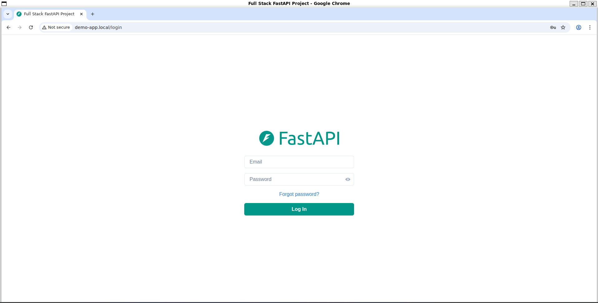
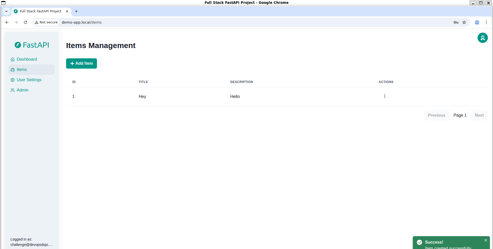

+++
title = 'Deploying a Multi Tier Application on Kubernetes'
date = 2025-07-13T17:56:00+01:00
draft = true
tags = ["devops", "Kubernetes"]
image = "images/featured-image.png"
+++

> _Part 3 of the **10 Kubernetes Projects in 10 Weeks** challenge_

Welcome to the third project in my Kubernetes project series!.
This time, we're deploying a multi-tier application consisting of frontend, backend and database tiers to a kubernetes cluster.
The goal here is to understand networking and the distinction between stateful vs stateless applications and how to treat them in Kubernetes.

A common architecture for web applications consists of three main components or tiers:
- A presentation layer (frontend)
- A business logic layer (backend)
- A data storage layer (database)

Each responsible for a specific part of the application. The presentation layer handles user interactions, the business logic layer processes requests and the data storage layer manages data persistence.
These components can be deployed as separate services in a Kubernetes cluster, allowing for better scalability, maintainability, and resource utilization.

In this project, our frontend is a React application that will be served by an Nginx server, the backend is a python application that will communicate with the frontend and the database is a postgresql instance that will store data for the backend.

The first two tiers can be considered stateless, meaning they do not store any data that needs to persist across restarts. The database tier, however, is stateful, as it needs to retain data even if the pod is restarted or rescheduled.

There are two main approaches to handle stateful applications in Kubernetes:
- A Deployment with a single replica and a Persistent Volume Claim (PVC) for the database tier, allowing it to retain data across pod restarts.
- A StatefulSet, which is specifically designed for stateful applications and provides features like stable network identities and persistent storage.

For the purpose of simplicity, we will use a Deployment with a PVC for the database tier in this project. Although, in a production environment, it is recommended to use a StatefulSet for stateful applications.

We would be using minikube to host our kubernetes cluster, so ensure you have it installed and running on your local machine.

The code for this project can be found in this [repo](https://github.com/0xdod/kubernetes-practice/tree/main/multi-tier-app).
Let us begin 🚀🚀.

## Stateful Applications in Kubernetes

We will start by deploying the database tier of our application, which is a PostgreSQL instance. 

Databases need to store data persistently, even if the pod is restarted or rescheduled. To achieve this, we will use a Persistent Volume (PV) and a Persistent Volume Claim (PVC).

As I have introduced in the previous project, a **Persistent Volume (PV)** is a piece of storage in your cluster that can be statically or dynamically provisioned. It abstracts the underlying storage infrastructure and allows you to use it across different pods.

Stateful applications in kubernetes are handled differently than stateless applications. Stateful applications may require persistent storage to retain data, or need to maintain a stable IP address or identity across pod restarts, while stateless applications do not.

This can be a complex topic particularly when it comes to managing data consistency, scaling, and failover in a clustered or distributed environment. However, Kubernetes provides several resources to help manage stateful applications, such as StatefulSets, Persistent Volumes (PVs), and Persistent Volume Claims (PVCs).


Create a k8s directory to hold all our kubernetes manifests, change to that directory and create a file named `postgres-deployment.yaml` inside it.

```yaml
apiVersion: v1
kind: Service
metadata:
  name: demo-postgres
  labels:
    app: demo-app
spec:
  ports:
    - port: 5432
  selector:
    tier: database
  clusterIP: None
---
apiVersion: v1
kind: PersistentVolumeClaim
metadata:
  name: postgres-pvc
  labels:
    app: demo-app
spec:
  storageClassName: standard
  accessModes:
    - ReadWriteOnce
  resources:
    requests:
      storage: 8Gi
---
apiVersion: apps/v1
kind: Deployment
metadata:
  name: demo-database
  labels:
    app: demo-app
spec:
  selector:
    matchLabels:
      tier: database
  strategy:
    type: Recreate
  template:
    metadata:
      labels:
        tier: database
    spec:
      containers:
      - image: "postgres:17"
        name: postgres
        env:
        - name: POSTGRES_PASSWORD
          valueFrom:
            secretKeyRef:
              name: postgres-pass
              key: password
        ports:
        - containerPort: 5432
          name: postgres
        volumeMounts:
        - name: postgres-data
          mountPath: /var/lib/postgresql
      volumes:
      - name: postgres-data
        persistentVolumeClaim:
          claimName: postgres-pvc
```

The above configuration does the following:
- Create a Headless Service named `demo-postgres` to expose the PostgreSQL instance on port 5432.
- Create a Persistent Volume Claim named `postgres-pvc` to request 8Gi of storage from the default storage class.
- Create a Deployment named `demo-database` that runs a PostgreSQL instance with the specified environment variables and volume mounts.

A headless service is a type of service that does not have a cluster IP assigned to it. It allows direct access to the pods without load balancing, which is useful for stateful applications like databases where you want to connect directly to a specific pod.
Think of it as being at a house party and looking for the restroom, you go to the receptionist and they provide you with a list of all restrooms so you go to the one you want.
Since our pods are stateful and we only have a single replica, we do not need load balancing, we can directly access the pod using the headless service.

To set up our database we need a password for the `postgres` user. Passwords are sensitive data, kubernetes provides a way to store sensitive data in a secure manner using **Secrets**.

We create a secret named `postgres-pass` to store the password for the `postgres` user. Create a file named `kustomization.yaml` in the k8s directory and add the following content:

```yaml
secretGenerator:
- name: postgres-pass
  literals:
  - password=password
resources:
  - postgres-deployment.yaml
```

Apply the directory using the following command:

```bash
kubectl apply -k ./
```

This should create the PostgreSQL deployment, service and persistent volume claim in your cluster. To test this works, we have to setup our backend.

## Backend Deployment

To deploy our backend, we need to build a docker image and push to dockerhub so our cluster can pull from the docker registry.

In the root of the repo, run the following commands

```bash
cd backend
cp .env.example .env
docker build -t <your-dockerhub-username>/demo-backend:latest .
docker push <your-dockerhub-username>/demo-backend:latest
```

If you encounter authentication issues while pushing to dockerhub, you can login using the following command:

```bash
docker login
```

Create a `backend-deployment.yaml` file with the following content in the k8s directory:

```yaml
apiVersion: apps/v1
kind: Deployment
metadata:
  name: demo-backend
  labels:
    app: demo-app
spec:
  selector:
    matchLabels:
      tier: backend  
  replicas: 2
  template:
    metadata:
      labels:
        tier: backend
    spec:
      containers:
      - name: demo-backend
        image: 0xdod/demo-backend:latest
        ports:
        - containerPort: 8000
      restartPolicy: Always
---
apiVersion: v1
kind: Service
metadata:
  name: demo-backend
spec:
  selector:
    tier: backend
  ports:
  - port: 8000
    targetPort: 8000
```

The above configuration does the following:
- Create a Deployment named `demo-backend` that runs the backend application with 2 replicas.
- Create a Service named `demo-backend` to expose the backend application on port 8000.

We didn't specify the Service type because it defaults to `ClusterIP`, which is suitable for internal communication between services in the cluster.
Our backend application will communicate with the PostgreSQL database using the `demo-postgres` service we created earlier, and external traffic will be routed to the backend service through an Ingress resource we would create later.

Apply the kubernetes manifests using the following command:

```bash
kubectl apply -f backend-deployment.yaml
```

We should be able to verify that the backend application is running by checking the pods and services:

```bash
kubectl get pods -l tier=backend
kubectl get svc 
```

We can also check the logs of the backend pod to ensure it is running correctly:

```bash
kubectl logs -l tier=backend
```

If you encounter any issues, you can check the events in the namespace to see if there are any errors:

```bash
kubectl describe pods -l tier=backend
```

With our backend application running, we can now move on to deploying the frontend application.


## Frontend Deployment

To deploy our frontend, we need to build a docker image and push to dockerhub so our cluster can pull from the docker registry.
At the root of the repo, run the following commands

```bash
cd frontend
docker build -t <your-dockerhub-username>/demo-frontend:latest .
docker push <your-dockerhub-username>/demo-frontend:latest
```

We will now create a deployment for the frontend application using the image we just pushed to dockerhub.
The deployment will create a pod that runs the Nginx server serving our React application.
In the k8s directory, create a file `frontend-deployment.yaml` with the following content.

```yaml
apiVersion: apps/v1
kind: Deployment
metadata:
  name: demo-frontend
  labels:
    app: demo-frontend
spec:
  selector:
    matchLabels:
      tier: frontend  
  replicas: 2
  template:
    metadata:
      labels:
        tier: frontend
    spec:
      containers:
      - name: demo-frontend
        image: 0xdod/demo-frontend:latest
        ports:
        - containerPort: 80
      restartPolicy: Always
---
apiVersion: v1
kind: Service
metadata:
  name: demo-frontend
spec:
  selector:
    tier: frontend
  ports:
  - port: 80
    protocol: TCP
---
```

Apply the configuration using the following command:


```bash
kubectl apply -f frontend-deployment.yaml
```

This would create 2 replicas of the react application and put them behind a cluster IP service.
Since users need to access the frontend application from outside the cluster, we will  have to expose our application to the internet, we can either change the service type to `LoadBalancer` so that it can be accessed from outside the cluster or use an `Ingress` resource to expose the service.

An `Ingress` resource is the best option here because a `LoadBalancer` creates an actual load balancer per service via the cloud provider, which can be expensive and unnecessary when you have multiple services or routes to expose.

An `Ingress Controller` is used to route traffic to the appropriate service based on the request path or host, which is perfect for HTTP(S) workloads. 
There are different choices for ingress controllers, such as Nginx, Traefik, and HAProxy. For this project, we will use the Nginx Ingress Controller.

For minikube, you can enable the Nginx Ingress Controller using the following command:

```bash
minikube addons enable ingress ingress-dns
```

Create a file named `ingress.yaml` in the k8s directory and add the following content:


```yaml
apiVersion: networking.k8s.io/v1
kind: Ingress
metadata:
  name: demo-app-ingress
spec:
  rules:
  - host: demo-app.local
    http:
      paths:
      - path: /
        pathType: Prefix
        backend:
          service:
            name: demo-frontend 
            port:
              number: 80
      - path: /api
        pathType: Prefix
        backend:
          service:
            name: demo-backend
            port:
              number: 8000

```

The ingress controller receives the requests, checks rules and forwards the request to the appropriate service based on the host and path specified in the ingress resource.

We can then apply the ingress resource using the following command:

```bash
kubectl apply -f frontend-ingress.yaml
```

Before we can access the frontend application, we need to ensure that our local machine can resolve the `demo-app.local` domain to the IP address of the ingress controller.

Modify your `/etc/hosts` file, add the following line:

```
127.0.0.1 demo-app.local
```

Open your browser and navigate to `http://demo-app.local`, you should see the frontend application running.

> If you are using minikube via WSL 2 on windows you may encounter issues accessing the ingress resource. You can run the `minikube tunnel` command in a separate terminal to expose the ingress controller to your local machine, and ensure you are accessing it via a browser in your WSL 2 context. You can install Linux GUI apps like chrome in WSL and launch it from there.



We have successfully deployed the frontend application and exposed it to the internet using an ingress resource.

You can login with the credentials in the `backend/.env` file, 
```
...
FIRST_SUPERUSER=challenge@devopsdojo.com
FIRST_SUPERUSER_PASSWORD=devopsdojo57
...
```

Navigate to the items section and try creating a new item, you should see the item being created and stored in the PostgreSQL database.




If you restart the deployments for the postgres database, you would notice that the data is still retained, this is because we used a Persistent Volume Claim to store the data for the database.


## Conclusion

We have successfully deployed a multi-tier application on Kubernetes consisting of a frontend, backend and database tier.

We learned how to handle stateful applications using Persistent Volumes and Persistent Volume Claims, and how to configure networking for our pods with Services and expose our applications to the internet using Ingress resource.

This only scratches the surface of what you can do with Kubernetes, but it is a good starting point to understand how to deploy and manage different types of applications in a Kubernetes cluster.
