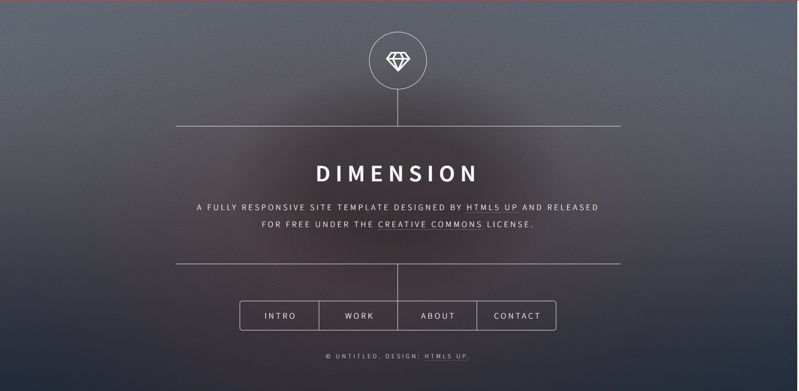

+++
title = 'Deploying a Static Website to a Kubernetes Cluster'
date = 2025-06-26T21:05:38+01:00
draft = false
tags = ['devops', 'kubernetes']
image = "images/featured-image.png"
+++

> _Part 1 of the **10 Kubernetes Projects in 10 Weeks** challenge_

Welcome to the first of my Kubernetes project series! This week, we're diving into the fundamental building blocks of Kubernetes by deploying a simple static website using Caddy, a powerful web server, on our Minikube cluster.

The goal of this project is to solidify your understanding of core Kubernetes objects: **Pods**, **ReplicaSets**, **Deployments**, and **Services**. By the end, you'll see how these components work together to ensure your application is running reliably and is accessible.
 
---

## Prerequisites

- [Docker](https://docs.docker.com/engine/install/0) or [Docker Desktop](https://docs.docker.com/desktop/)
- [Dockerhub account](https://hub.docker.com/)
- [Minikube](https://minikube.sigs.k8s.io/docs/start/) 
- [Kubectl](https://kubernetes.io/docs/tasks/tools/) 

The code for this project can be found in this [repo](https://github.com/0xdod/kubernetes-practice/tree/main/static-website)

---

## The Static Site: Our Simple Web Page

First we need our website, for this project, we'll use a ready made example website which you can clone with the command below.

```bash
git clone https://github.com/cloudacademy/static-website-example.git
```

Any website will do really, could be a simple `index.html` file, we just need to get  this HTML file into our Caddy container.

A common approach is to build a custom Docker image that includes your static content and a Caddy configuration. We will configure our Caddy server to serve files from its default `/srv` directory, and will place our website content there.


## Caddy: Our Web Server

[Caddy](https://caddyserver.com/) is an open-source, HTTP/2-enabled web server with automatic HTTPS. It's known for its simplicity and ease of configuration, making it a great choice for serving static sites.

To configure Caddy as a static site server, create a new file called `Caddyfile` with the following content

```Caddyfile
:80
root * /srv
file_server
```

To build our custom image, we have to include this `Caddyfile` and our static site into a docker image based on the official caddy docker image.

Create a new file called `Dockerfile` with the following content.

```Dockerfile
FROM caddy:2.7.5-alpine
WORKDIR /srv
COPY static-website-example /srv
COPY Caddyfile /etc/caddy/Caddyfile
EXPOSE 80
CMD ["sh", "-c", "caddy run --config /etc/caddy/Caddyfile --adapter caddyfile"]
```


We need to host this image in a container registry so our kubernetes cluster can pull from this image to run our containers.

```bash
docker build -t k8s-static-website-example .
```

> Note:
> Before pushing to dockerhub we may need to authenticate
>
>```bash
> docker login
>```
>

After building the image successfully, we have to push our image to a container registry where out kubernetes cluster can pull the image to run our containers.

```bash
docker push <username>/k8s-static-website-example
```

With these out of the way, we can focus on kubernetes next.


## Core Kubernetes Objects Explained

Before we deploy, let's briefly review the Kubernetes objects we'll be using:

### 1. Pods

A Pod in kubernetes is the smallest deployable unit of compute. A Pod is an abstraction over a container (or a group of tightly coupled containers) and represents a single instance of a running process in your cluster.

You can think of a Pod like a single, self-contained worker unit in a factory, performing a specific task.

**Key characteristics:**
    
  - Pods are ephemeral: they are not designed to be persistent. If a Pod dies, it's not automatically restarted.
        
  - They share the same network namespace, IP address, and storage volumes.
        

### 2. ReplicaSets

A ReplicaSet is a controller that ensures a specified number of Pod replicas are running at all times. If a Pod fails, the ReplicaSet automatically creates a new one to replace it.

A ReplicaSet is like a supervisor in the factory, making sure there are always enough worker units (Pods) to meet the production quota.

    
**Key characteristics:**
    
  - Ensures high availability by maintaining a desired number of Pods.
        
  - Primarily used for scaling and self-healing.
        

### 3. Deployments

A Deployment is a higher-level abstraction that manages the deployment and scaling of a set of Pods. Deployments use ReplicaSets under the hood to achieve their goals. They provide declarative updates to Pods and ReplicaSets.

A Deployment is like the factory manager who decides how many production lines (ReplicaSets) are needed and how to update them without stopping production.

This is typically what is used to run applications in kubernetes.

    
**Key characteristics:**
    
  - Handles rolling updates and rollbacks.
        
  - Manages the lifecycle of your application's Pods.
        
  - The most common way to deploy stateless applications.
      

### 4. Services

A Service is a network abstraction that is used to expose an application running on a set of Pods as a network service.
Services provide a stable IP address and DNS name for your application, even as Pods come and go.
    
Think of a Service is like the front desk of the factory, providing a single, consistent address for customers to reach the factory, regardless of which specific worker unit (Pod) handles their request.

**Key characteristics:**
    
  - Decouples the application from the Pods' ephemeral nature.
        
  - Enables load balancing across multiple Pods.
        
  - Different types: `ClusterIP` (internal), `NodePort` (external via node IP), `LoadBalancer` (external via cloud load balancer), `ExternalName`.
          

## Deploying Our Static Site with Caddy

Ensure your Minikube cluster is running

```bash
minikube start
```

We'll define two Kubernetes resources: a Deployment for our Caddy server and a Service to expose it.

### 1. Deployment

This Deployment will manage our Caddy Pods. We'll use the custom image we built in the previous step.

```yaml
apiVersion: apps/v1
kind: Deployment
metadata:
  name: caddy-static-site-deployment
  labels:
    app: caddy-static-site
spec:
  replicas: 2 
  selector:
    matchLabels:
      app: caddy-static-site
  template:
    metadata:
      labels:
        app: caddy-static-site
    spec:
      containers:
        - name: caddy-static-site
          image: <dockerhub username>/k8s-static-website-example
          ports:
            - containerPort: 80
```


### 2. Service

This Service will expose our Caddy Deployment to the outside world, so users can access the site.

```yaml
apiVersion: v1
kind: Service
metadata:
  name: caddy-static-site-service
spec:
  selector:
    app: caddy-static-site 
  type: LoadBalancer 
  ports:
    - port: 80 
      targetPort: 80 
```

The  `selector: app: caddy-static-site` tells the Service to route traffic to any Pods that have the label `app: caddy-static-site`, and `type: LoadBalancer` makes our service accessible from outside the cluster and gives us an IP address we can use to access it. 

The LoadBalancer type delegates provisioning of a load balancer to the cloud platform and is not a native kubernetes resource. Since we are using minikube and not a cloud managed kubernetes cluster, we cannot provision an actual load balancer. 

Luckily, minikube has support for LoadBalancer through tunnelling. In a seperate terminal tab, run the command

```bash
minikube tunnel
```


## Steps to Deploy

1. **Save the YAML files:**
           
    - Save the `Deployment` definition into `deployment.yaml`.
        
    - Save the `Service` definition into `service.yaml`.
        
2. **Apply the Deployment:**
    
    ```
    kubectl apply -f deployment.yaml
    ```
    
    Monitor the deployment and underlying ReplicaSet and Pods:
    
    ```
    kubectl get deployment caddy-static-site-deployment
    kubectl get replicaset -l app=caddy-static-site
    kubectl get pods -l app=caddy-static-site -w
    ```
    
    You should see two Pods being created and eventually reach `Running` status.
    
4. **Apply the Service:**
    
    ```
    kubectl apply -f service.yaml
    ```
    
    Verify: `kubectl get service caddy-static-site-service`
    


Once all resources are deployed and the Pods are running, you can access your static site. Open your web browser and navigate to `http://localhost`.




To demonstrate the resiliency ReplicaSets provide, delete any one of the pods

```bash
kubectl delete pod <pod-name>
```


Observe how the ReplicaSet immediately creates a new one to maintain the desired replica count.

```bash
kubectl get pod
```

To scale your deployment up or down:
    
```bash
kubectl scale deployment caddy-static-site-deployment --replicas=3
kubectl get pods -l app=caddy-static-site
```

Now imagine you want to update your site, you would only need to trigger a rollout of the Deployment (e.g., by changing the image tag, even if it's the same, or by using `kubectl rollout restart deployment caddy-static-site-deployment`). 

Observe the rolling update process where old Pods are gracefully terminated and new ones are brought up.
    

## Conclusion

This week, we've successfully deployed a static website on Kubernetes using Caddy, even though in practice, no one does this, but have been able to gather hands-on experience with the foundational Kubernetes objects.

In summary

- **Pods** are the smallest unit of deployment.
    
- **ReplicaSets** ensures the desired number of Pods are always running.
    
- **Deployments** are used to manage the lifecycle, scaling, and updates of your application.
    
- **Services** provide stable network access to your application.
    

Understanding these core concepts is paramount for building and managing any application on Kubernetes. Next week, we'll explore more foundational concept. ✌🏿
